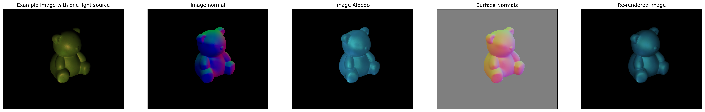
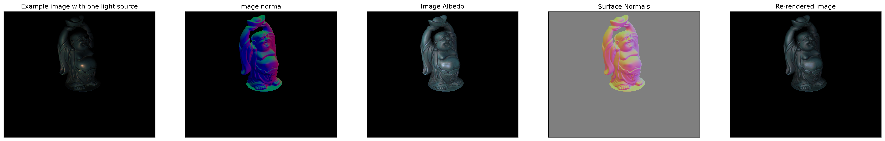
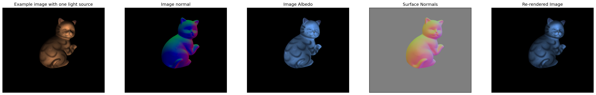
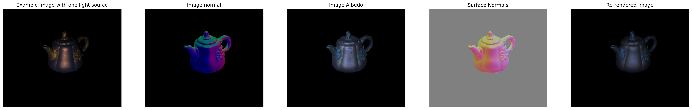

# 🌟 Photometric Stereo for 3D Surface Reconstruction

## 🎯 Overview

This repository implements **Photometric Stereo**, a powerful technique for reconstructing the **3D shape** of an object by analyzing multiple images taken from different viewpoints and under varying lighting conditions. By exploiting the intensity variations at each pixel across these images, the algorithm estimates **surface normals** and **albedo**, enabling the reconstruction of surface geometry. 🌍✨

Photometric Stereo is perfect for scenarios where only a sequence of images with different light sources are available, providing an efficient method for capturing the 3D structure of objects without needing specialized depth sensors or 3D scanning equipment. 🖼️📐

### 🔑 Key Features:
- **Estimation of Surface Normals**: The method uses pixel intensity variations to estimate the surface orientation at each point. 🧭
- **Albedo Recovery**: The algorithm estimates the albedo (reflectivity) of the object's surfaces, essential for realistic rendering. 🌈
- **Surface Re-rendering**: Using the recovered properties (normals and albedo), the system can re-render the object from novel perspectives or under different lighting conditions. 🎥🔄

## 📖 Introduction

### 📸 The Principle of Photometric Stereo

The core idea behind **Photometric Stereo** is simple but powerful: by capturing multiple images of an object under different lighting conditions, we can use pixel intensity values across these images to infer surface normal vectors at each point. The relationship between light source, surface orientation, and pixel intensity is governed by the **Lambertian Reflection Model**, which assumes the surface reflects light diffusely. 💡

By solving a system of equations based on this model, we can estimate surface normals, which describe the orientation of the surface at each point. Once normals are estimated, we can recover other properties like the **albedo** and fully reconstruct the 3D geometry of the object. 🏗️🌟

#### 🧮 Mathematical Formulation:
Given an image sequence of an object under varying lighting conditions, the intensity value at pixel $(x, y)$ for light source $i$ is given by:

$$
I_i(x, y) = \rho(x, y) \cdot \mathbf{n}(x, y) \cdot \mathbf{l_i}
$$

Where:
- $\rho(x, y)$ is the **albedo** (reflectivity) of the surface at pixel $(x, y)$,
- $\mathbf{n}(x, y)$ is the **surface normal** at pixel $(x, y)$,
- $\mathbf{l_i}$ is the **direction vector** of the light source $i$.

By solving this equation across multiple images captured with different light source directions, we can estimate the surface normal $n(x, y)$ and albedo $\rho(x, y)$ for each pixel, unlocking the 3D surface geometry of the object. 💡🔍


### ⚡ Challenges:
- **Handling Shadows and Highlights**: Shadows and highlights can create outliers in intensity values, making surface normal estimation tricky. The implementation uses robust outlier detection to deal with these artifacts. 🌑🌟
- **Ambiguities in Surface Normal Estimation**: A single image can’t distinguish between mirror-image surface orientations. Using multiple images with different lighting conditions helps to resolve this ambiguity. 🔄

### 🖼️ Figure 1: Principle of Photometric Stereo

The diagram below shows how multiple images under different lighting conditions are used to recover surface normals and albedo. 👇

  
  
  


## ⚙️ Setup

To run the project, you need to set up the appropriate environment and install the required dependencies. Follow the steps below to get started:

### 1️⃣ Step 1: Create a Conda Environment

It’s recommended to use a **Conda environment** to manage dependencies and ensure everything is isolated. 🌱

```bash
conda create --name ps python=3.9
conda activate ps
